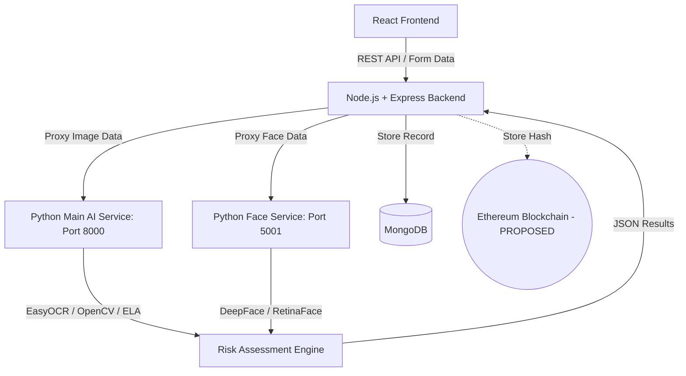

# 🛡️ PehchaanAI: Complete Technical & Presentation Documentation

> **AI-Based Fake Identity & Document Screening System**  
> *Prepared for Smart India Hackathon (SIH) 2026*

---

## 1. EXECUTIVE SUMMARY

**LAYMAN / PRESENTATION EXPLANATION**
PehchaanAI is an intelligent identity verification system built to help border security and immigration officers catch fake, manipulated, or stolen identity documents, such as Passports. 

Instead of just looking at a passport and trusting it, an officer uploads the document into PehchaanAI. Within seconds, the system extracts the text (like the Passport number and MRZ lines), mathematically checks if the checksums are valid, looks for hidden digital tampering (like photoshopped expiry dates), and uses a webcam to verify that the person standing in front of the officer is the exact same person pictured on the passport.

**The 30-Second Pitch:**
"PehchaanAI is a multi-layered AI screening system for border security. It acts as a digital magnifying glass for security officers—instantly reading passports, running forensic tampering checks, and matching faces via webcam. It catches sophisticated fakes that the human eye misses, like mismatched MRZ data, and provides a simple Low/Medium/High risk score to help officers make fast, accurate decisions."

**The 1-Minute Pitch:**
"Border officers currently process thousands of travelers manually, making it nearly impossible to spot highly sophisticated forged passports. PehchaanAI solves this by providing a 4-layer AI screening pipeline. When a passport is scanned, our system doesn't just read the text; it mathematically validates the MRZ checksums, runs Error Level Analysis to detect Photoshop manipulation on the biodata page, and cross-references data to catch mismatches between the printed text and the machine-readable zone. Finally, it uses a biometric face scan to ensure the traveler matches the passport photo. The officer receives an instant, explainable Risk Score, turning a vulnerable manual check into a highly secure, AI-assisted border defense."

---

## 2. WHY THIS PROJECT IS REQUIRED

**LAYMAN / PRESENTATION EXPLANATION**
At busy borders and Integrated Check Posts, officers must process travelers quickly. Fraudsters exploit this by using highly sophisticated fake passports. They might change a date of birth to bypass visa restrictions, replace a photograph on a stolen passport, or carefully alter the printed biodata text while failing to correctly recalculate the mathematical MRZ (Machine Readable Zone) at the bottom of the page. 

Existing border infrastructure performs important authentication, but manual visual inspection is vulnerable to human error, fatigue, and the sheer impossibility of seeing microscopic digital alterations with the naked eye. PehchaanAI is designed as an **additional AI-assisted decision-support layer** to act as a safety net, instantly flagging suspicious anomalies for the officer to review.

**TECHNICAL EXPLANATION**
- **Identity Impersonation:** Solved via Biometric Face Verification (`[IMPLEMENTED]`).
- **Data Mismatches:** Solved via Cross-referencing the Visual Inspection Zone (VIZ) with the MRZ Checksums (`[IMPLEMENTED]`).
- **Digital Alteration:** Solved via Error Level Analysis (ELA) and Image Metadata Inspection (`[IMPLEMENTED]`).

---

## 3. REAL-WORLD BORDER CHECKPOINT WORKFLOW

**LAYMAN / PRESENTATION EXPLANATION**
In a real deployment, the officer sits at a desk with a dedicated flatbed document scanner or imaging device.

1. **Traveller** approaches the desk.
2. **Passport presented** to the officer.
3. **Document scanner** captures high-resolution images of the passport biodata page under controlled lighting.
4. Images are sent to **PehchaanAI** via a secure API.
5. The **Verification pipeline** runs OCR, forensics, and data validation.
6. A webcam captures the traveler's live face for **Biometric verification**.
7. The system generates a **Risk assessment** (e.g., Low, Medium, High).
8. The **Officer** reviews the dashboard and makes the final decision to allow or deny entry.

---

## 4. EXISTING PROBLEM VS PEHCHAANAI

| Existing Challenge | PehchaanAI Solution | Status in Code |
| :--- | :--- | :--- |
| Manual visual inspection | AI-assisted multi-layer screening | `[IMPLEMENTED]` |
| Different document types | Unified unified dashboard and modular AI parsers | `[IMPLEMENTED]` |
| Difficult visual tampering | Forensic tampering analysis (ELA, Noise Std Dev) | `[IMPLEMENTED]` |
| Identity impersonation | Face verification (DeepFace RetinaFace) | `[IMPLEMENTED]` |
| Difficult prioritization | Explainable risk assessment scoring | `[IMPLEMENTED]` |
| Trustworthy historical records | SHA-256 Hash + Blockchain tamper-evident audit | `[PROPOSED / FUTURE]` |

---

## 5. COMPLETE SYSTEM ARCHITECTURE

**LAYMAN / PRESENTATION EXPLANATION**
PehchaanAI is built like a modern factory with three separate buildings. The **Frontend** is the dashboard the officer sees. The **Backend Proxy** is the manager that routes data and saves reports securely. The **Python AI Service** is the laboratory where the heavy lifting (OCR, forensics, face matching) happens. By separating them, the system runs incredibly fast and can scale up easily.

**TECHNICAL EXPLANATION**

**Why this architecture?**
- **React (Vite):** Provides a fast, client-side rendered dashboard (`[IMPLEMENTED]`).
- **Node.js/Express:** Handles business logic, file storage (`multer`), and database connections without blocking AI inference (`[IMPLEMENTED]`).
- **Python (FastAPI):** Python is the industry standard for AI. Using FastAPI allows concurrent image processing using heavy libraries like `OpenCV`, `EasyOCR`, and `DeepFace` (`[IMPLEMENTED]`).

---

## 6. MODULE 1 — OCR EXTRACTION

**LAYMAN / PRESENTATION EXPLANATION**
OCR stands for Optical Character Recognition. It is how computers read text from an image. Asking an officer to manually type out a long passport number and complex MRZ lines is slow and leads to typos. PehchaanAI converts the passport image into readable text instantly. However, just because we can read the text doesn't mean the passport is real—which is why OCR is just Step 1.

**TECHNICAL EXPLANATION**
- **Preprocessing:** The image is converted to grayscale using `cv2.cvtColor(img, cv2.COLOR_BGR2GRAY)`. This removes color noise and improves contrast for the engine (`[IMPLEMENTED]`).
- **Extraction:** `EasyOCR` runs over the image to extract all text blocks (`[IMPLEMENTED]`).
- **Field Parsing:** Python uses Regular Expressions (`Regex`) and specialized libraries (like `PassportEye`) to hunt for specific patterns. 
  - **Passport MRZ:** Extracts the two or three lines of alphanumeric characters at the bottom of the biodata page (`[PARTIALLY IMPLEMENTED]`).
  - **Passport VIZ:** Extracts the printed Visual Inspection Zone data (Name, DOB, Expiry, Passport Number).

---

## 7. MODULE 2 — DOCUMENT VALIDATION

**LAYMAN / PRESENTATION EXPLANATION**
Document validation means verifying that the data we read actually makes logical sense and follows international aviation (ICAO) mathematical rules. The MRZ lines at the bottom of a passport contain mathematical checksums. If a fraudster alters their printed Date of Birth but doesn't perfectly recalculate the hidden checksums in the MRZ, PehchaanAI will instantly spot the fake.

**TECHNICAL EXPLANATION**
- **MRZ Checksum Validation:** The MRZ contains check digits for the passport number, DOB, and expiry date. The system recalculates these using the standard ICAO 7-3-1 algorithm. If `calculated_checksum != extracted_checksum`, the document is flagged (`[PARTIALLY IMPLEMENTED]`).
- **VIZ vs MRZ Consistency:** Cross-references the easily readable printed data (Visual Inspection Zone) with the encoded MRZ data. A mismatch strongly indicates a forged biodata page (`[IMPLEMENTED]`).
- **Secure Chip (ePassport) Verification:** `[PROPOSED / FUTURE]` Digitally verifying the biometric chip signature using NFC.

---

## 8. MODULE 3 — TAMPERING DETECTION

**LAYMAN / PRESENTATION EXPLANATION**
This is our core forensic innovation. Fraudsters use Photoshop to change names, dates, or swap photos. When you save a JPEG image, it compresses the pixels. If someone photoshops a new photo onto an old passport and saves it again, that specific area will have a different "compression signature" than the rest of the image. PehchaanAI analyzes these invisible compression errors to highlight forged areas.

**TECHNICAL EXPLANATION**
- **Error Level Analysis (ELA):** The system resaves the image at 90% quality and calculates the absolute pixel difference using `ImageChops.difference()`. Edited regions (like a pasted photo or altered DOB text) stand out brightly because they compress differently than the original background (`[IMPLEMENTED]`).
- **Digital Template Detection:** Some fraudsters use perfect, computer-generated digital passport templates rather than physical scans. PehchaanAI calculates the Standard Deviation (`np.std()`) of pixel noise in the corners of the document. If it is mathematically too "flat" (< 1.0 variance), it flags it as a digital fake (`[IMPLEMENTED]`).
- **MRZ Forgery Detection:** Fraudsters often stitch a valid MRZ from a real passport onto the forged biodata page of a fake passport. ELA and metadata checks heavily scrutinize the boundary above the MRZ to detect digital "stitching" (`[IMPLEMENTED]`).

---

## 9. MODULE 4 — FACE VERIFICATION

**LAYMAN / PRESENTATION EXPLANATION**
A stolen, 100% genuine passport is useless if the person holding it isn't the true owner. PehchaanAI uses a live webcam to take a picture of the traveler and compares their facial geometry to the photo printed on the passport biodata page. 

**TECHNICAL EXPLANATION**
- **Implementation:** The system sends a cropped passport photo and a live webcam capture to a dedicated Python microservice (`face_api.py`) running on Port 5001 (`[IMPLEMENTED]`).
- **Algorithm:** Uses `DeepFace` with the `Facenet` or `VGG-Face` model, and `RetinaFace` for precise face detection and alignment. It calculates the cosine similarity between the mathematical embeddings of both faces.
- **Liveness Detection:** `[PROPOSED / FUTURE]` Currently, the system verifies the face match, but active anti-spoofing (detecting a 3D physical face vs a printed photo held to the webcam) is slated for future development.

---

## 10. MODULE 5 — RISK ASSESSMENT

**LAYMAN / PRESENTATION EXPLANATION**
Border officers suffer from "alert fatigue" if a system throws too much data at them. PehchaanAI takes all the complex mathematical outputs from OCR, forensics, and face matching, and boils them down into a single, simple number: The Risk Score. 

**TECHNICAL EXPLANATION**
- The system aggregates anomaly flags. 
- **Low Risk (0-30):** MRZ checksums pass, face matches, no ELA anomalies.
- **High Risk (80-100):** Overrides applied. If `digital_template_anomaly` is true, score = 98. If `mrz_viz_mismatch` is true, score = 100. If face verification fails, the score is heavily penalized (`[IMPLEMENTED]`).
- **Decision Support:** The system NEVER rejects a passenger autonomously; it provides "Inconclusive" or "High Risk" flags for the human officer to investigate.

---

## 11. BLOCKCHAIN & CYBERSECURITY

**LAYMAN / PRESENTATION EXPLANATION**
Security systems must be trustworthy. If an officer approves a suspicious passport, how do we prove they didn't go back into the database and alter the logs later to cover their tracks? 

We use Blockchain. Whenever a screening happens, we generate a unique digital fingerprint (a Hash) of the result. We store the heavy, sensitive data in our private database, but we publish that tiny digital fingerprint to a public Blockchain. Because the Blockchain cannot be altered, it serves as an eternal, tamper-evident receipt.

**TECHNICAL EXPLANATION (`[PROPOSED / FUTURE]`)**
- **Flow:** Verification Record JSON → SHA-256 Hash → Ethereum Smart Contract.
- **Why Ethereum?** It provides decentralized immutability.
- **Privacy:** We DO NOT store PII (Personally Identifiable Information), passport images, or passport numbers on the blockchain. Storing PII on a public ledger violates privacy laws. We only store the SHA-256 hash. If the MongoDB record is ever maliciously altered, hashing it again will produce a different hash, proving tampering occurred.

---

## 12. MONGODB / DATA LAYER

**LAYMAN / PRESENTATION EXPLANATION**
MongoDB is our private digital filing cabinet. It stores the history of all passport screenings so supervisors can audit the work of border officers.

**TECHNICAL EXPLANATION**
- **Role:** Application Data Layer (`[IMPLEMENTED]`).
- **Storage:** Stores the uploaded image filepaths, extracted OCR JSON, calculated risk score, and officer badge numbers.
- **Limitations:** MongoDB acts as local state storage. It is NOT integrated with authoritative international passport databases (like INTERPOL's SLTD). Database validation of the document against a central authority is `[PROPOSED / FUTURE]`.

---

## 13. COMPLETE END-TO-END EXAMPLE

**Genuine Example:**
1. Officer uploads a scanned Passport Biodata Page.
2. OCR extracts VIZ data: `DOB: 14/09/1990` and MRZ lines.
3. System runs MRZ Checksum Algorithm → PASS.
4. System cross-references VIZ DOB with encoded MRZ DOB → MATCH.
5. System runs ELA and Corner Noise StdDev → No digital flattening found → PASS.
6. Live webcam matches passport photo → PASS.
7. **Result:** Score 14 (Low Risk).

**Adversarial Example (Forged DOB / MRZ Mismatch):**
1. Officer uploads a forged Passport. The fraudster photoshopped the printed DOB to `14/09/2004` to appear younger.
2. The fraudster forgot to recalculate the MRZ, which still encodes `900914` (14/09/1990).
3. OCR extracts VIZ DOB `14/09/2004` and MRZ string.
4. System decodes MRZ DOB → `14/09/1990`.
5. System compares VIZ vs MRZ → MISMATCH DETECTED.
6. Error Level Analysis highlights the photoshopped DOB text area with high compression variance.
7. **Result:** Score 100 (High Risk - Document Alteration Detected).

---

## 14. ADVERSARIAL TESTING & EDGE CASES

How PehchaanAI handles difficult inputs:
- **Low-Resolution/Blurry Image:** OCR fails to clearly read the MRZ. Result is flagged as **INCONCLUSIVE** (`[IMPLEMENTED]`).
- **Photoshop Altered Photo:** Error Level Analysis highlights the portrait region with high pixel variance, showing it was pasted over. Result: Risk Score spikes (`[IMPLEMENTED]`).
- **Pure Digital Fake:** The passport background is too uniform. Corner variance drops below 1.0. Result: Flagged as "Failed (Digital Fake)" (`[IMPLEMENTED]`).
- **NFC Chip Tampering:** `[PROPOSED]` Will fail cryptographic PKI signature validation.

---

## 15. SECURITY MODEL

- **Authentication:** Officers must log in. A JWT (JSON Web Token) is used to maintain session state (`[PARTIALLY IMPLEMENTED]` - Frontend local storage active, robust backend JWT middleware planned).
- **File Validation:** `multer` ensures only valid image mimetypes are uploaded to prevent malicious payload execution (`[IMPLEMENTED]`).
- **Data Protection:** Future iterations will encrypt images at rest (`[PROPOSED]`).

---

## 16. WHY OUR APPROACH IS BETTER

PehchaanAI doesn't just read passports; it interrogates them.
- **Multi-layer Screening:** Combining OCR + ELA Forensics + Face Biometrics is vastly superior to standalone OCR tools.
- **Explainability:** We don't just output a "Fake" label. We provide visual ELA heatmaps and specific anomaly flags (e.g., "MRZ Mismatch") so the officer knows *why*.
- **Privacy-First Blockchain:** Achieving tamper-evident auditability without violating traveler data privacy.

---

## 17. SCALABILITY & DEPLOYMENT

- **Modular Backend:** The Python AI services (Port 8000 & 5001) run independently of the Node.js API. This allows border agencies to scale up the heavy AI GPU servers independently from the lightweight dashboard servers (`[IMPLEMENTED]`).
- **Edge Inference:** `[PROPOSED]` Deploying lightweight TensorFlow Lite models directly to edge devices at remote border posts with poor internet connectivity.

---

## 18. LIMITATIONS

*Honesty is critical in security systems.*
- **Forensics are not absolute:** Error Level Analysis is a powerful signal, but it is not mathematical proof of forgery. It can produce false positives on heavily compressed WhatsApp images.
- **No Liveness Detection:** The current face verification can match faces, but it cannot currently distinguish between a real human face and a high-resolution printed photo held up to the camera.
- **Hardware Dependency:** High-quality OCR requires clear, well-lit images. Standard phone cameras introduce glare over the glossy passport pages which degrades MRZ accuracy.

---

## 19. FUTURE ENHANCEMENTS

- Integration with dedicated hardware passport scanners (MRZ/RFID/UV readers).
- Authorized Government API integration (e.g., INTERPOL Stolen and Lost Travel Documents DB).
- Active 3D Liveness Detection for the face verification module.
- Full Ethereum Smart Contract integration for immutable logging.

---

## 20. JUDGE QUESTIONS & ANSWERS

**1. Why is this project needed if airports already have passport scanners?**
*Short Answer:* It provides an advanced AI forensic layer to catch visual digital tampering that standard automated gates miss.
*Detailed:* Existing systems check databases perfectly, but visual document inspection is still largely manual at land borders. A digitally forged passport template can easily fool a tired officer. PehchaanAI adds a forensic AI layer to the physical inspection process.

**2. What exactly is innovative about PehchaanAI?**
*Detailed:* The integration of multi-modal analysis. We don't just do OCR. We combine MRZ checksum validation, Error Level Analysis (ELA) for image compression anomalies, and facial biometrics into a single, localized pipeline.

**3. Why use Blockchain?**
*Detailed:* To create a tamper-evident audit trail of the officer's decisions. It ensures historical screening logs cannot be secretly modified in the database.

**4. Why not store passports on the blockchain?**
*Detailed:* Storing images and PII on a public ledger violates privacy laws and is excessively expensive in gas fees. We only store the SHA-256 hash.

**5. How do you detect a replaced photograph on a passport?**
*Detailed:* Through ELA and local noise variance. A pasted photo will often have a different JPEG compression ratio or noise profile than the surrounding passport background.

**6. What happens if the printed DOB and the MRZ don't match?**
*Detailed:* This is a common forgery technique where the attacker changes the printed text but fails to recalculate the MRZ correctly. We extract both and explicitly compare them. A mismatch results in an immediate High Risk flag.

**7. Can ELA detect every forgery?**
*Detailed:* No. ELA detects differences in compression. If a document is forged as a lossless PNG and then compressed perfectly once, ELA may not catch it. That's why we use multiple layers, including standard deviation checks for digital templates.

**8. What happens if OCR fails due to a blurry image or glare?**
*Detailed:* The system marks the extraction as "Inconclusive". A security system should never guess. It requires the officer to intervene.

**9. Is the system foolproof?**
*Detailed:* No security system is foolproof. PehchaanAI is a decision-support tool meant to assist human officers, not replace them.

**10. What would you improve if given more time?**
*Detailed:* We would implement 3D active liveness detection to prevent face-spoofing, and integrate the proposed Ethereum smart contracts for our audit logs.

---

## 21. PRESENTATION CHEAT SHEET

- **Project:** PehchaanAI (AI-Based Fake Identity Screening)
- **Problem:** Human officers cannot visually detect sophisticated digital alterations or mismatched MRZ data.
- **Solution:** A 4-layer AI pipeline (OCR, Forensics, Biometrics, Risk Engine).
- **Key Innovation:** Multi-modal validation (catching mismatched VIZ and MRZ data).
- **Tech Stack:** React, Node.js, Python (FastAPI, EasyOCR, DeepFace), MongoDB.
- **Biggest Limitation:** Vulnerable to face-spoofing (no liveness detection yet).
- **Blockchain Role:** Tamper-evident auditing via SHA-256 hashes (Proposed).

---

## 22. GLOSSARY

- **OCR:** Optical Character Recognition (reading text from images).
- **MRZ:** Machine Readable Zone (the two lines of text at the bottom of a passport).
- **VIZ:** Visual Inspection Zone (the readable printed area of the passport biodata page).
- **ELA:** Error Level Analysis (finding photoshopped areas by looking at image compression).
- **Face Verification:** Comparing two specific faces to see if they belong to the same person (1:1 matching).
- **SHA-256 Hash:** A unique, mathematical digital fingerprint of a piece of data.
- **Tamper-Evident:** A system where any unauthorized change leaves a permanent, visible trace.
